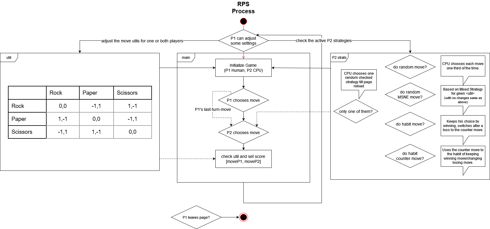
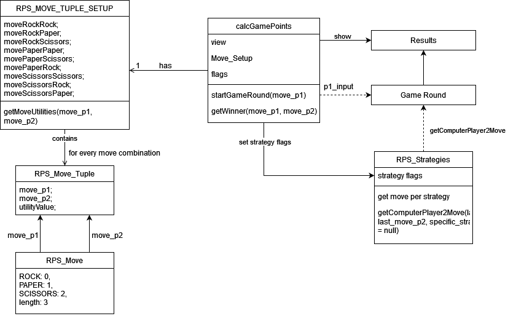

# RPSGameVisualization

This is a Visualization of the Rock, Paper, Scissors Game showing its connections to Game Theory. It was made by M-Gentes in cooperation with Professor Dr. Oscar Lin.

## Learning Objectives of the Rock, Paper, Scissors Game
- explain the concept of [zero-sum games](https://en.wikipedia.org/wiki/Zero-sum_game)
- explain the concept of [mixed-strategy equilibria](https://en.wikipedia.org/wiki/Strategy_(game_theory)#Mixed_strategy)
- use mixed strategies
## Introduction
- You can play Rock, Paper, Scissors against a Computer player (CPU).
- By default the CPU chooses their move randomally in a equal manner, so one of the three options is choosed one third of the time.
- But by pressing the **Settings button** ⚙ in the top bar, there are some settings to change up the game.
- The area with the checkboxes determines the behavior of the CPU agent. So for each checked strategy, the CPU chooses randomally one of his strategies (based on a uniform distribution probability). 
    - By default the CPU chooses each round one of his strategies, but if **Opponent uses only one of the checked Strategies** is checked, it chooses one of his strategies for the hole game. 
- With the **Utility table** below you can change the utility values for the tuple of options used, so [Rock,Paper] could result in a different score as [-1,1] respectively for each player. 
    - The rows show the options for player 1 (real person) and the columns show the options for player 2 (CPU).

## Strategies
- The strategies for the CPU are the following: 
    - **Opponent uses random move:** CPU chooses each move one third of the time.
    - **Opponent uses his Mixed Strategy Nash Equilibria:** CPU chooses each move based on the given utility for the RPS tuples used (without changing the utilities it results to the same as the previous strategy).
    - **Opponent uses his moves in a certain habit:** CPU uses the same move of the last round if it won, if it lost it uses the counter move to the move it was using. After a tie it chooses a random move.
    - **Opponent tries to counter common habit moves:** CPU tries to counter the previous strategy. If the real player has the habit of the previous strategy, the CPU will be winning all the time (except after ties).

## MSNE

The Expected Utilities (using the move Left (Rock), Center (Paper) or Right (Scissors) - as seen in the utility table) for player 2 (CPU) can be put together to an linear equation system and with that you can calculate the probabilities for the **Mixed Strategy Nash equilibria**. By restructuring the equations with some substitutions let them be calculated in base Javascript:

```math
EUU = EUM = EUD
```

```math
EUU = dL a2 + dC d2 + (1-dL-dC) g2
```
```math
EUM = dL b2 + dC e2 + (1-dL-dC) h2
```
```math
EUD = dL c2 + dC f2 + (1-dL-dC) i2
```

$\implies$

```math
x = {(-d2+e2+g2-h2) \over (a2-b2-g2+h2)}
```
```math
y = {(h2-g2) \over (a2-b2-g2+h2)}
```
```math
p = -b2 + h2 + c2 - i2
```
```math
q = -h2 + i2
```

- Restructure to get sigma probability variables

```math
dC = {((y) p + q) \over ((-x) p + q + e2 - f2)}
```
```math
dL = dC (x) + (y)
```
```math
dR = 1 - dC - dL
```

- see the [Game Theory 101](https://www.youtube.com/watch?v=C6_72XPpKNQ&list=PLKI1h_nAkaQoDzI4xDIXzx6U2ergFmedo&index=39) video series for more information, which was used as a basis

## Images

- RPS process diagramm
    - 

- RPS code diagramm
    - 
## Credits

Sounds of Freesound.org were used on this application.

- "Stone.wav" by danielpodlovics of Freesound.org
- "Book, Flipping Through Pages, A.wav" by InspectorJ (www.jshaw.co.uk) of Freesound.org
- "Scissors.wav" by Godowan of Freesound.org
- "metallic_cling1.mp3" by ZorroBms1001 of Freesound.org